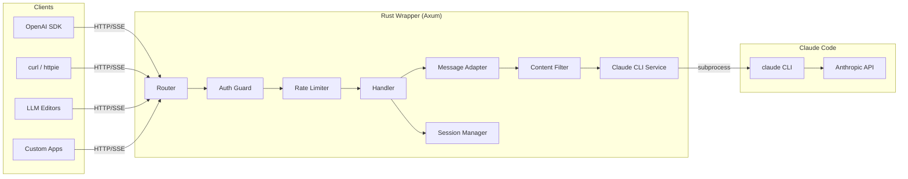
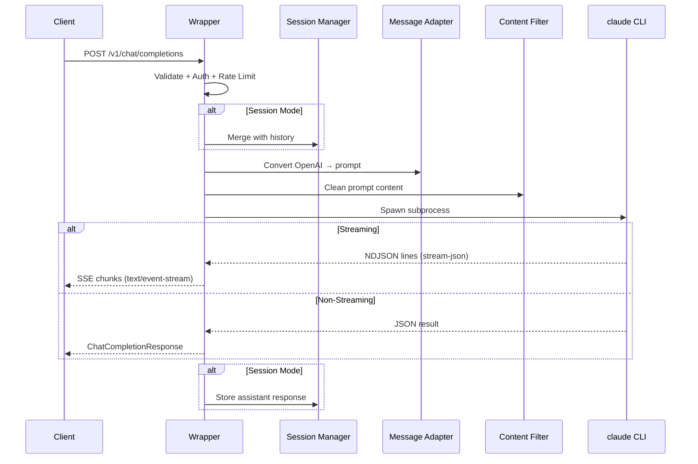
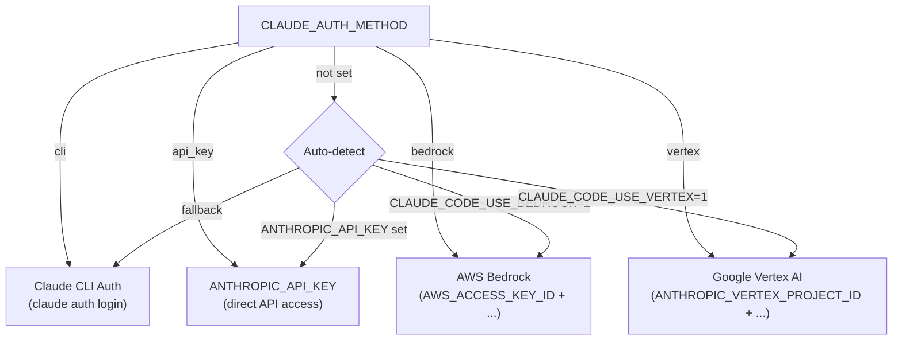
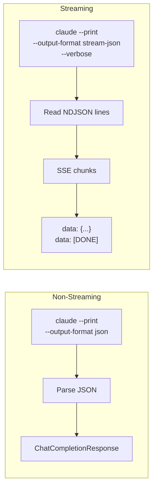

<p align="center">
  
  
  
  
  
</p>

# Claude Code OpenAI Wrapper

**Drop-in OpenAI-compatible API server that routes to Claude Code.** Any app, SDK, or tool that speaks OpenAI can now talk to Claude — zero code changes required.

Built in Rust for a single 4.7 MB static binary. Starts in milliseconds. No runtime dependencies beyond `claude` CLI.

```
┌─────────────────┐         ┌──────────────────┐         ┌─────────────┐
│  OpenAI Client  │ ──────► │  This Wrapper    │ ──────► │ Claude CLI  │
│  (any SDK/tool) │  HTTP   │  (Rust / Axum)   │  proc   │  (claude)   │
└─────────────────┘         └──────────────────┘         └─────────────┘
```

---

## Why?

You already have tools that talk to OpenAI — editors, scripts, agents, CI pipelines. Now they all work with Claude, without rewriting anything.

| What you get | How |
|---|---|
| **OpenAI SDK compatibility** | Same `/v1/chat/completions` contract |
| **Anthropic SDK compatibility** | Native `/v1/messages` endpoint too |
| **Streaming SSE** | Real-time `text/event-stream` chunks |
| **Extended thinking** | Surface Claude's reasoning via `include_thinking` |
| **Session memory** | Multi-turn conversations via `session_id` |
| **Multi-provider auth** | CLI, API key, Bedrock, Vertex AI |
| **4.7 MB binary** | Rust + static linking, no Python/Node runtime |

---

## Architecture



### Request Flow



---

## Quick Start

### From Source

```bash
# Clone
git clone https://github.com/clebermasters/claude-code-openai-wrapper
cd claude-code-openai-wrapper

# Build
cargo build --release

# Run (claude CLI must be in PATH)
./target/release/claude-code-openai-wrapper
```

### Docker

```bash
docker build -f Dockerfile.rust -t claude-wrapper .
docker run -p 8000:8000 -v ~/.claude:/root/.claude claude-wrapper
```

### Verify

```bash
curl http://localhost:8000/health
# {"status":"healthy","service":"claude-code-openai-wrapper"}

curl http://localhost:8000/v1/models
# {"object":"list","data":[{"id":"claude-opus-4-5-20250929",...},...]}
```

---

## Usage

### OpenAI Python SDK

```python
from openai import OpenAI

client = OpenAI(base_url="http://localhost:8000/v1", api_key="not-needed")

# Non-streaming
response = client.chat.completions.create(
    model="claude-opus-4-6",
    messages=[{"role": "user", "content": "Explain ownership in Rust"}]
)
print(response.choices[0].message.content)

# Streaming
for chunk in client.chat.completions.create(
    model="claude-sonnet-4-6",
    messages=[{"role": "user", "content": "Write a haiku about coding"}],
    stream=True
):
    print(chunk.choices[0].delta.content or "", end="")
```

### curl

```bash
# Non-streaming
curl -X POST http://localhost:8000/v1/chat/completions \
  -H "Content-Type: application/json" \
  -d '{"model":"claude-opus-4-6","messages":[{"role":"user","content":"Hello!"}]}'

# Streaming
curl -N http://localhost:8000/v1/chat/completions \
  -H "Content-Type: application/json" \
  -d '{"model":"claude-opus-4-6","messages":[{"role":"user","content":"Hello!"}],"stream":true}'
```

### Session Continuity

```bash
# First request — establish context
curl -X POST http://localhost:8000/v1/chat/completions \
  -H "Content-Type: application/json" \
  -d '{"model":"claude-opus-4-6","messages":[{"role":"user","content":"My name is Alice."}],"session_id":"s1"}'

# Follow-up — Claude remembers
curl -X POST http://localhost:8000/v1/chat/completions \
  -H "Content-Type: application/json" \
  -d '{"model":"claude-opus-4-6","messages":[{"role":"user","content":"What is my name?"}],"session_id":"s1"}'
# → "Your name is Alice."
```

### Enable Claude Code Tools

By default, tools are disabled for fast Q&A. Enable them when you need file access:

```bash
curl -X POST http://localhost:8000/v1/chat/completions \
  -H "Content-Type: application/json" \
  -d '{"model":"claude-opus-4-6","messages":[{"role":"user","content":"List files in /tmp"}],"enable_tools":true}'
```

### Extended Thinking

Surface Claude's internal reasoning process alongside the final answer. Enable via request body or header:

```bash
# Via request body
curl -X POST http://localhost:8000/v1/chat/completions \
  -H "Content-Type: application/json" \
  -d '{"model":"claude-sonnet-4-5-20250929","include_thinking":true,"messages":[{"role":"user","content":"What is 15% of 240?"}]}'

# Via header
curl -X POST http://localhost:8000/v1/chat/completions \
  -H "Content-Type: application/json" \
  -H "X-Claude-Include-Thinking: true" \
  -d '{"model":"claude-sonnet-4-5-20250929","messages":[{"role":"user","content":"What is 15% of 240?"}]}'
```

Response includes a `thinking` field on the message:

```json
{
  "choices": [{
    "message": {
      "role": "assistant",
      "content": "15% of 240 = 36",
      "thinking": "The user is asking me to calculate 15% of 240..."
    }
  }]
}
```

When disabled (default), the `thinking` field is omitted entirely — fully backwards-compatible. Streaming also supports thinking via `{"delta": {"thinking": "..."}}` chunks.

---

## API Endpoints

### Core

| Method | Path | Description |
|--------|------|-------------|
| `GET` | `/` | Interactive landing page with API explorer |
| `POST` | `/v1/chat/completions` | OpenAI-compatible chat (streaming + non-streaming) |
| `POST` | `/v1/messages` | Anthropic-compatible messages |
| `GET` | `/v1/models` | List available Claude models |
| `GET` | `/health` | Health check |
| `GET` | `/version` | Version info |

### Sessions

| Method | Path | Description |
|--------|------|-------------|
| `GET` | `/v1/sessions` | List active sessions |
| `GET` | `/v1/sessions/stats` | Session statistics |
| `GET` | `/v1/sessions/{id}` | Get session details |
| `DELETE` | `/v1/sessions/{id}` | Delete a session |

### Tools & Config

| Method | Path | Description |
|--------|------|-------------|
| `GET` | `/v1/tools` | List available Claude Code tools |
| `GET/POST` | `/v1/tools/config` | Get/update tool configuration |
| `GET` | `/v1/tools/stats` | Tool usage statistics |
| `GET` | `/v1/auth/status` | Authentication status |
| `POST` | `/v1/compatibility` | Check request compatibility |
| `POST` | `/v1/debug/request` | Debug request validation |

### MCP (Placeholder)

| Method | Path | Description |
|--------|------|-------------|
| `GET/POST` | `/v1/mcp/servers` | List/register MCP servers |
| `GET` | `/v1/mcp/stats` | MCP statistics |

---

## Configuration

All configuration via environment variables (or `.env` file):

| Variable | Default | Description |
|----------|---------|-------------|
| `PORT` | `8000` | Server port |
| `CLAUDE_WRAPPER_HOST` | `0.0.0.0` | Bind address |
| `CLAUDE_CLI_PATH` | `claude` | Path to claude binary |
| `CLAUDE_CWD` | temp dir | Working directory for Claude |
| `CLAUDE_AUTH_METHOD` | auto-detect | `cli`, `api_key`, `bedrock`, `vertex` |
| `ANTHROPIC_API_KEY` | — | Direct API key |
| `API_KEY` | — | Protect wrapper endpoints with Bearer token |
| `DEFAULT_MODEL` | `claude-sonnet-4-5-20250929` | Default model |
| `MAX_TIMEOUT` | `600000` | Wrapper-side request timeout (ms) |
| `MAX_REQUEST_SIZE` | `10485760` | Max body size (bytes) |
| `CORS_ORIGINS` | `["*"]` | CORS allowed origins (JSON array) |
| `DEBUG_MODE` | `false` | Enable debug logging |
| `RATE_LIMIT_ENABLED` | `true` | Enable per-endpoint rate limiting |
| `RATE_LIMIT_CHAT_PER_MINUTE` | `10` | Chat endpoint rate limit |

**CLI subprocess configuration** (forwarded to the `claude` CLI process):

| Variable | Default | Description |
|----------|---------|-------------|
| `CLAUDE_CODE_MAX_OUTPUT_TOKENS` | model default | Max output tokens for CLI responses |
| `BASH_DEFAULT_TIMEOUT_MS` | `120000` | CLI bash tool default timeout |
| `BASH_MAX_TIMEOUT_MS` | `600000` | CLI bash tool hard ceiling (max 600s) |
| `MAX_THINKING_TOKENS` | model default | Extended thinking token budget |
| `CLAUDE_CLI_MAX_TURNS` | `0` (unlimited) | Max agent turns per request |

### Authentication Providers



### Claude Custom Headers

Pass Claude-specific options via HTTP headers:

| Header | Example | Description |
|--------|---------|-------------|
| `X-Claude-Model` | `claude-opus-4-6` | Override model per-request |
| `X-Claude-Max-Turns` | `20` | Max agent turns for this request |
| `X-Claude-Max-Thinking-Tokens` | `10000` | Extended thinking token budget |
| `X-Claude-Include-Thinking` | `true` | Return thinking in response |
| `X-Claude-Allowed-Tools` | `Read,Write,Bash` | Override allowed tools |
| `X-Claude-Disallowed-Tools` | `WebFetch,WebSearch` | Override disallowed tools |
| `X-Claude-Permission-Mode` | `bypassPermissions` | Permission mode |

---

## Supported Models

| Model | Notes |
|-------|-------|
| `claude-opus-4-6` | Most intelligent — agents & deep reasoning |
| `claude-sonnet-4-6` | Best coding model |
| `claude-opus-4-5-20250929` | Premium intelligence + performance |
| `claude-sonnet-4-5-20250929` | Real-world agents & coding |
| `claude-haiku-4-5-20251001` | Fast & cost-effective |
| `claude-opus-4-1-20250805` | Upgraded Opus 4 |
| `claude-opus-4-20250514` | Original Opus 4 |
| `claude-sonnet-4-20250514` | Original Sonnet 4 |

> Aliases like `opus`, `sonnet`, `haiku` are resolved by the `claude` CLI.

---

## Project Structure

```
src/
├── main.rs                     # Server bootstrap + router
├── config.rs                   # Environment-based configuration
├── constants.rs                # Models, tools, rate limits
├── error.rs                    # OpenAI-compatible error responses
├── models/
│   ├── openai.rs               # ChatCompletionRequest/Response, SSE types
│   ├── anthropic.rs            # Anthropic Messages format
│   ├── session.rs              # Session info types
│   ├── tool.rs                 # Tool metadata types
│   └── mcp.rs                  # MCP server types
├── services/
│   ├── claude_cli.rs           # CLI subprocess (streaming + non-streaming)
│   ├── message_adapter.rs      # OpenAI messages → Claude prompt
│   ├── content_filter.rs       # Regex-based output filtering
│   ├── session_manager.rs      # In-memory sessions with TTL
│   ├── auth.rs                 # Multi-provider auth detection
│   ├── rate_limiter.rs         # Per-endpoint rate limiting (governor)
│   ├── tool_manager.rs         # Tool metadata + per-session config
│   ├── parameter_validator.rs  # Request validation + compatibility
│   └── mcp_client.rs           # MCP server registry (placeholder)
├── handlers/                   # Route handlers (chat, models, sessions, ...)
├── middleware/                  # Request ID, size limits, debug logging
└── assets/
    └── landing.html            # Interactive landing page
```

---

## Testing

```bash
cargo test
# running 167 tests
# test result: ok. 167 passed; 0 failed
```

**167 unit tests** across 14 modules covering models, services, auth, sessions, CLI parsing, content filtering, thinking extraction, and rate limiting.

---

## Docker

### Multi-stage Build

```bash
docker build -f Dockerfile.rust -t claude-wrapper .
```

### Docker Compose

```yaml
services:
  claude-wrapper:
    build:
      context: .
      dockerfile: Dockerfile.rust
    ports:
      - "8000:8000"
    volumes:
      - ~/.claude:/root/.claude
    environment:
      - ANTHROPIC_API_KEY=${ANTHROPIC_API_KEY}
```

---

## How It Works

The Python version used the `claude-agent-sdk` Python package. This Rust version calls the `claude` CLI directly as a subprocess:



**Content filtering** strips Claude-internal artifacts (thinking blocks, tool XML, image refs) before returning clean responses to the client.

**Session management** maintains an in-memory `HashMap<String, Session>` with 1-hour TTL and automatic cleanup every 5 minutes.

---

## Limitations

- **No function calling** — Claude tools are not mapped to OpenAI function calling format
- **No image input** — image content parts are converted to text placeholders
- **`n > 1` not supported** — only single completions
- **Temperature/top_p** — approximated via system prompt instructions, not native control
- **MCP connections** — server registry works, actual MCP protocol connections return 503

---

## Contributing

Contributions welcome. Open an issue or submit a PR.

```bash
# Development build
cargo build

# Run tests
cargo test

# Release build
cargo build --release
```

---

## License

MIT

---

<p align="center">
  <sub>Built with Rust and Axum. Not affiliated with Anthropic or OpenAI.</sub>
</p>
